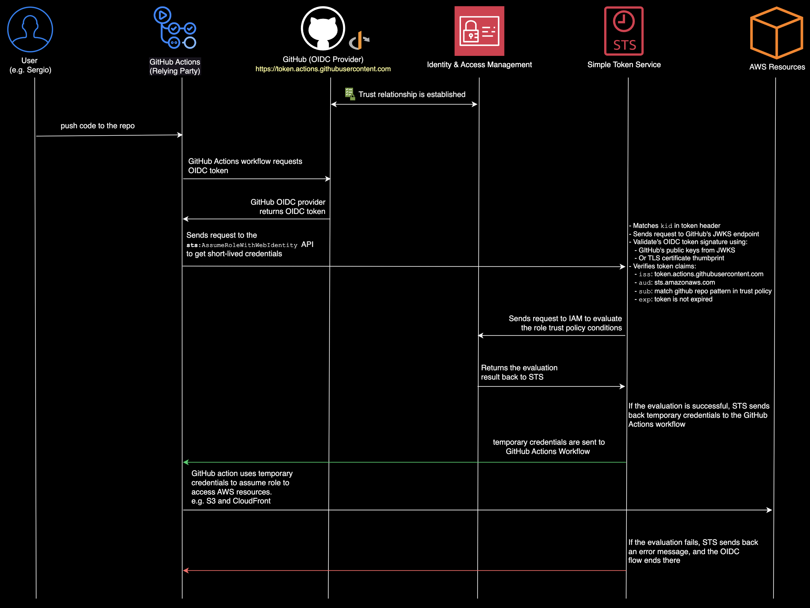

# IAM OIDC with GitHub Actions

This project demonstrates how to set up an IAM OIDC identity provider for GitHub Actions to assume an IAM role.

I've written a blog post about this project. You can read it [here](https://sergiopichardo.com/posts/github-actions-and-iam-oidc).

## Prerequisites

- AWS CLI 
- AWS CDK

## To run the project 

1. Clone the repository
2. Install dependencies
3. Run `npm run deploy`

